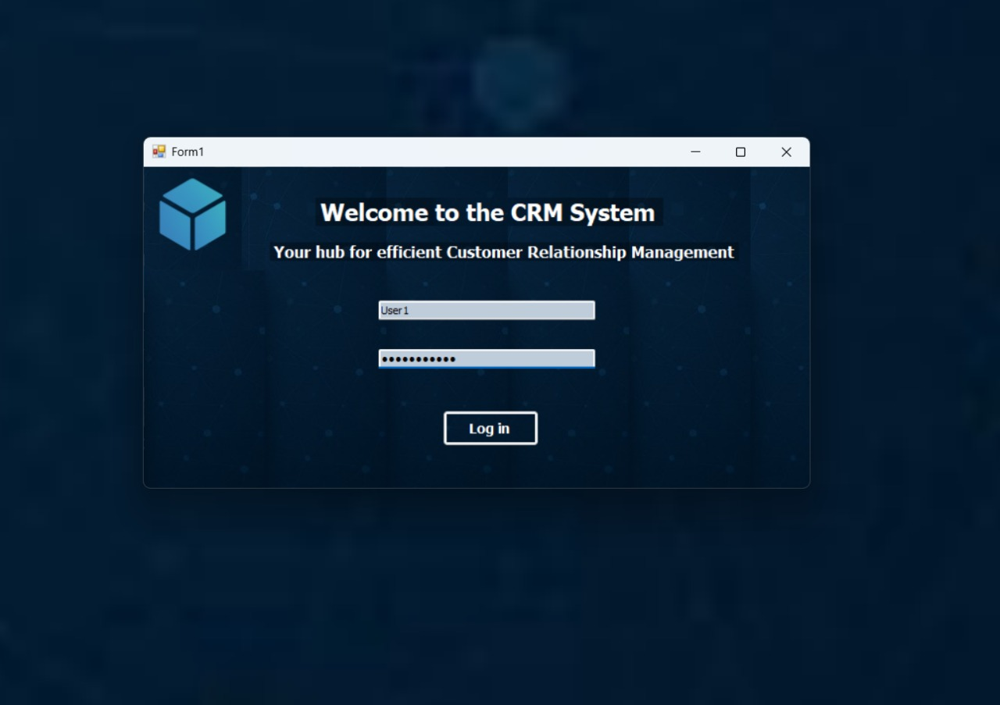
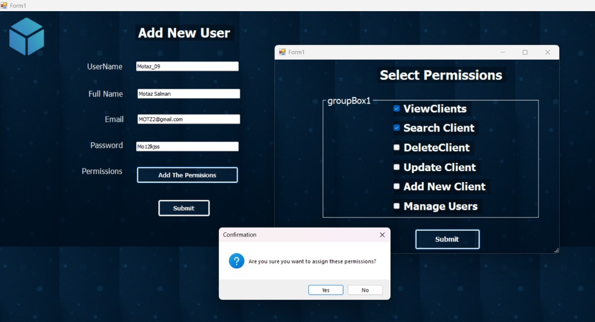
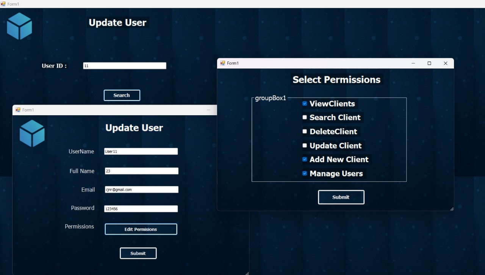
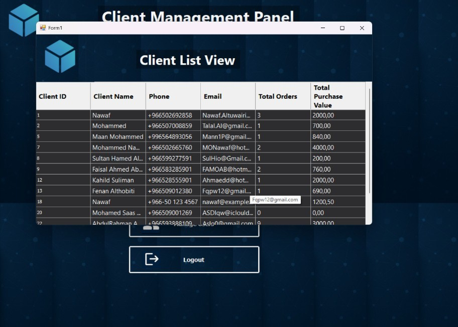
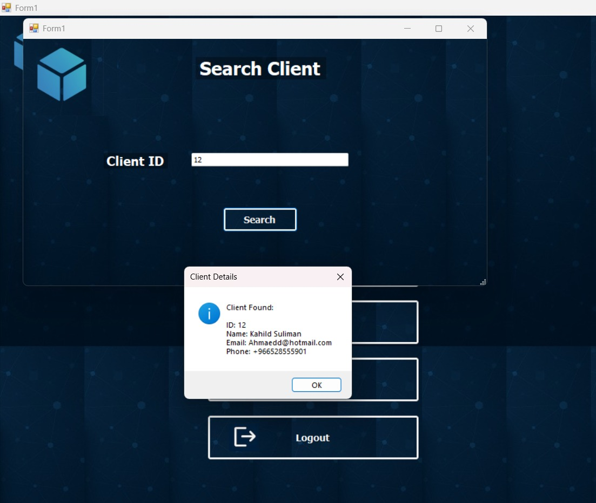
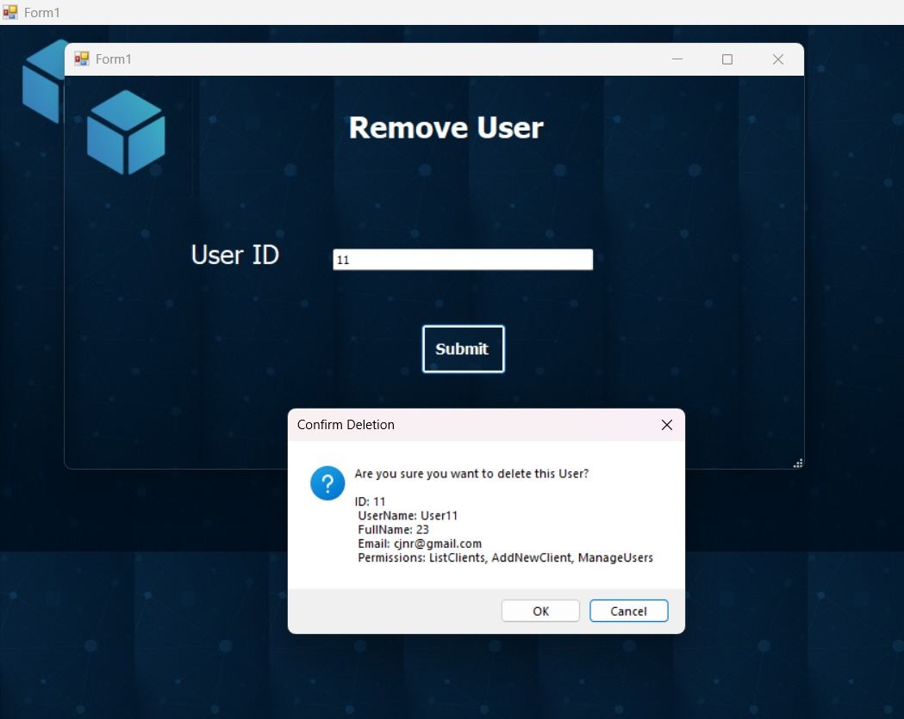

# CRM Desktop Application  
(Customer Relationship Management)

A simple CRM desktop application built using **C# Windows Forms** and **SQL Server**, following a basic **3-Tier Architecture** structure.

---

## Overview

This project is a **Customer Relationship Management (CRM) desktop application** designed to manage clients and system users.

The system allows users to store client information and control access to different parts of the application through user permissions.

The project was built **entirely by me from start to finish**, including:

- Database design
- Application structure
- Business logic implementation
- Windows Forms user interface

The main goal of the project was to practice building a **structured desktop system** while improving backend programming and problem-solving skills.

---

## Architecture

The application follows a simple **3-Tier Architecture** to separate responsibilities between different parts of the system.

### Presentation Layer (Windows Forms)

Handles the user interface and interactions.

Examples include:

- Login screen
- Client management forms
- User management screens
- Basic input validation before sending data

The UI layer does not communicate directly with the database.

---

### Business Layer

Contains the application logic.

Responsibilities include:

- Validating client data
- Managing application operations
- Handling permission checks
- Coordinating communication between UI and database

---

### Data Access Layer

Handles communication with the **SQL Server database**.

Responsibilities include:

- Executing SQL queries
- Reading and writing data
- Managing database connections

This layer keeps database operations separate from the rest of the application.

---

## Main Features

### Login System
- User authentication
- Login validation using database records

### User Management
- Add users
- Delete users
- Manage user permissions

### Client Management
- Add new clients
- Update client information
- Delete clients
- Search for clients

### Data Validation
- Basic input validation
- Prevent storing invalid data

---

## Database

The application uses a **SQL Server database**.

Main tables include:

### Clients
Stores customer information such as:

- ClientID
- ClientName
- Phone
- Email
- TotalOrders
- TotalPurchaseValue

### Users
Stores system users and permissions:

- UserID
- UserName
- FullName
- Email
- Password
- Permissions

The database schema and sample data are included in:

```

Database/CRMproject.sql

```

Running this script will create the database and insert sample data.

---

## Technologies Used

- C#
- .NET Framework
- Windows Forms
- SQL Server
- ADO.NET

---

## Project Structure

```

CRM-WinForms-App
│
├── BusinessLayer
├── ClsDataLayer
├── ClsClient
├── ClsUser_Person
│
├── Database
├── Screenshots
│
├── frmAddClient
├── frmManageUsers
├── frmDeleteUser
├── frmFindClient
│
├── App.config
├── Program.cs
├── CRM.sln
└── README.md

```

---

## How to Run the Project

### 1. Create the Database

Open **SQL Server Management Studio (SSMS)** and run the script located in:

```

Database/CRMproject.sql

```

This will create the database, tables, and sample data.

---

### 2. Configure the Connection String

Open:

```

App.config

````

Update the connection string to match your SQL Server setup.

Example:

```xml
<connectionStrings>
  <add name="CRMConnection"
       connectionString="Server=.;Database=CRMproject;Trusted_Connection=True;"
       providerName="System.Data.SqlClient"/>
</connectionStrings>
````

---

### 3. Run the Application

1. Open `CRM.sln` in **Visual Studio**
2. Build the solution
3. Run the application

---

## Screenshots













---

## Demo Video

[https://bit.ly/CRM-System-Demo](https://bit.ly/CRM-System-Demo)

---

## Developed By

Developed by **Nawaf Altowairqi**

GitHub
[https://github.com/TheNawafTech](https://github.com/TheNawafTech)
