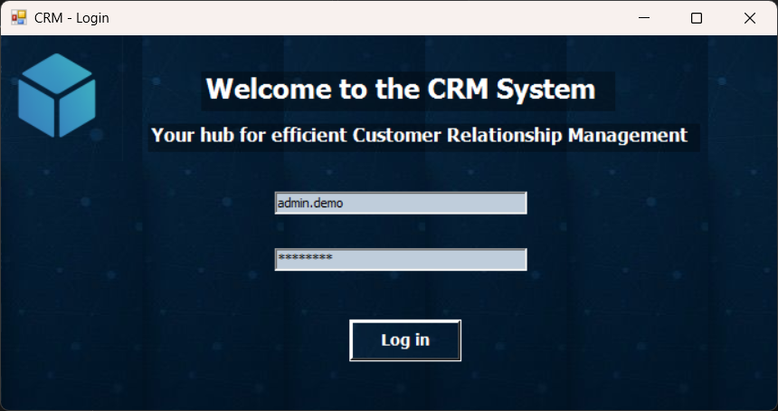
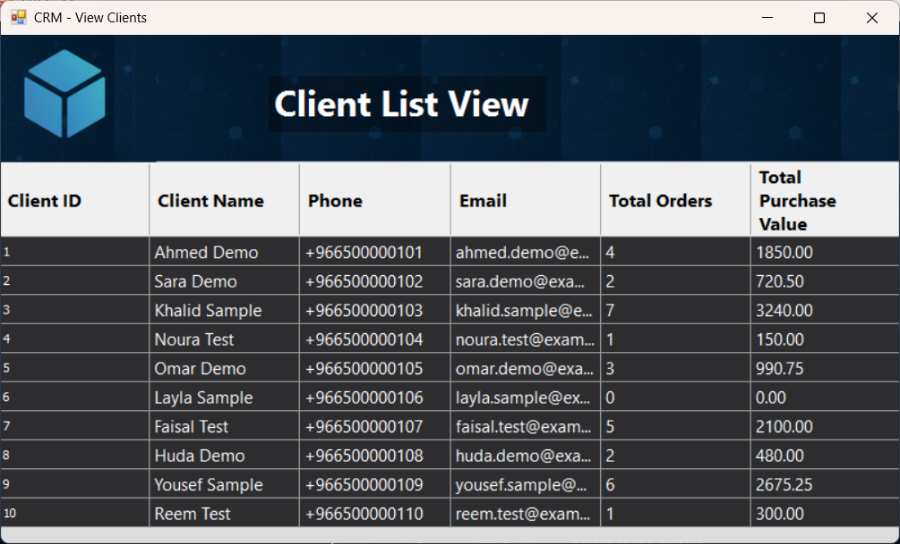
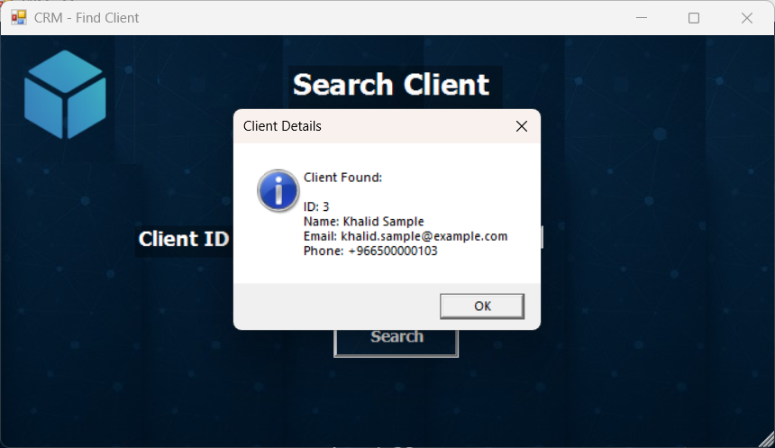
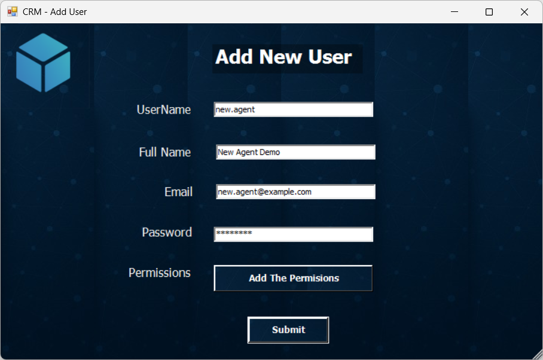
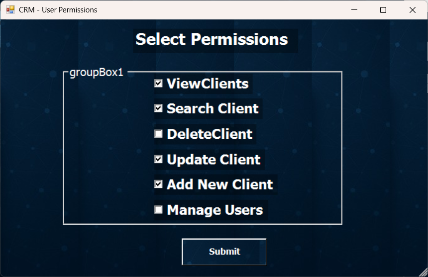
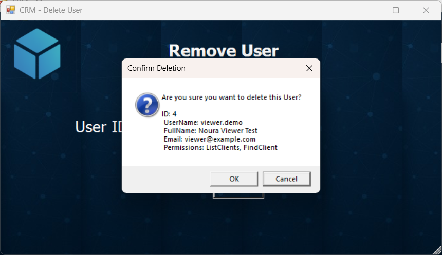

# CRM System

A Windows desktop CRM application built with C#, .NET Framework, Windows Forms and SQL Server. It manages clients and users, with permission-based access, through a layered architecture.

## Overview

The application covers:

- **Client management**: keeping client contact details and purchase totals.
- **User management**: creating application users and assigning their permissions.
- **Authentication**: signing in with a username and a hashed password.
- **Permission-based access**: each user only gets the actions their permissions allow.
- **SQL Server storage**: a relational schema created by a single script.

UI, business logic and data access are kept in separate projects.

## Features

**Client management**
- View the client list
- Add a client
- Find a client by ID
- Update a client (find by ID, then edit)
- Delete a client

**User management**
- View users
- Add a user and assign their permissions
- Find a user by ID
- Update a user, including permissions and an optional password change
- Delete a user

**Authentication and authorization**
- Login and logout
- Passwords stored as PBKDF2-SHA256 hashes with a random salt per password
- Permission-based main menu: View Clients, Search Clients, Add New Client, Update Client, Remove Client and Manage Users
- Unique usernames

**Reliability**
- Input validation for IDs, required fields, email addresses, phone numbers and purchase values
- "Not found" and database failures are reported to the user as different outcomes

## Architecture

```text
Windows Forms UI      CRM_WinForms (CRM.exe) + one class library per screen
        ↓
Business Layer        BusinessLayer: rules, validation, password hashing, result status
        ↓
Data Access Layer     ClsDataLayer (ADO.NET) + ClsDataAccessSettings (reads App.config)
        ↓
SQL Server            Database/CRMproject.sql
```

- **One executable:** `CRM_WinForms` builds `CRM.exe`. Every screen is a WinForms class library, referenced by it directly or through the main menu, so there is no other executable.
- **Shared models:** `ClsClient` and `ClsUser_Person` hold the model classes, used by all layers.
- **Layer boundaries:** forms never talk to the database directly.
  - Read operations return `Success`, `NotFound` or `Failure` from the business layer.
  - Write operations return whether the change was actually saved.

## Technology Stack

- C#
- .NET Framework 4.7.2
- Windows Forms
- SQL Server
- ADO.NET (`System.Data.SqlClient`)
- PBKDF2 via `System.Security.Cryptography`

## Security & Data Integrity

- **Password storage**
  - Passwords are hashed with PBKDF2-HMAC-SHA256: 100,000 iterations and a 16-byte random salt per password.
  - Each value is stored as `PBKDF2-SHA256$<iterations>$<salt>$<hash>`, and hashes are compared in constant time.
  - Plaintext passwords are never stored.
- **Password verification**
  - It happens in the business layer. The data layer looks the user up by username only, and SQL never compares passwords.
- **Password visibility**
  - Password hashes are never loaded into grids or the signed-in user object.
  - Password inputs are masked.
  - When editing a user, an empty password field keeps the current password.
- **Unique usernames**
  - Enforced by a `UNIQUE` constraint on `Users.UserName` and by a check in the business layer.
  - Names are trimmed, and comparison is case-insensitive under the default SQL Server collation.
- **Parameterized SQL**
  - Every value that comes from the user is passed to SQL as a parameter.
- **Authorization**
  - The main menu enables only the actions the signed-in user is allowed to use, and checks the permission again when an action is started.
- **Error handling**
  - Database failures are shown as a generic system error, separate from "not found".
  - Technical details go to `System.Diagnostics.Trace`.
- **Connections**
  - Connections, commands and readers are closed as soon as each operation ends.

## Screenshots

| Login | Client list |
|---|---|
|  |  |

| Find client | Add user |
|---|---|
|  |  |

| User permissions | Delete user |
|---|---|
|  |  |

All screenshots use the fictitious demo data from `Database/CRMproject.sql`.

## Getting Started

### Prerequisites

- **Windows**
- **Visual Studio** with the **.NET desktop development** workload, which includes the .NET Framework 4.7.2 targeting pack. The project was built and tested with Visual Studio 2022.
- **SQL Server**: any edition, including Express, Developer or LocalDB.
- **A tool to run the database script**: SQL Server Management Studio or `sqlcmd`. These are used only for setup; the application doesn't need them.

### 1. Clone the repository

```bash
git clone https://github.com/TheNawafTech/CRM-WinForms-App.git
cd CRM-WinForms-App
```

### 2. Create the database

Run `Database/CRMproject.sql` against your SQL Server instance. You can open it in SSMS and execute it, or use `sqlcmd` from a Command Prompt or PowerShell in the repository folder:

```powershell
sqlcmd -S . -E -i Database\CRMproject.sql
```

Replace `.` with your instance name if you don't use the default one (for example `.\SQLEXPRESS` or `(localdb)\MSSQLLocalDB`).

The script:
- creates the `CRMproject` database if it doesn't exist;
- creates the tables;
- loads the demo data.

> **Warning:** running the script again drops and recreates the tables, which resets all data to the demo set.

### 3. Configure the connection string

The connection string is read from `App.config` at the repository root, in the `CRMproject` entry:

```xml
<connectionStrings>
  <add name="CRMproject"
       connectionString="Server=.;Database=CRMproject;Integrated Security=True;"
       providerName="System.Data.SqlClient" />
</connectionStrings>
```

The default connects to the local default SQL Server instance with Windows authentication. To use a different instance, change `Server`, for example:
- `Server=.\SQLEXPRESS;`
- `Server=(localdb)\MSSQLLocalDB;`

No code changes are needed. After a build, the same setting is in `bin\Debug\CRM.exe.config`, and you can edit it there without rebuilding.

### 4. Build and run

1. Open `CRM.sln` in Visual Studio.
2. Right-click **CRM_WinForms** and choose **Set as Startup Project**. Visual Studio stores the startup project per user, so a fresh clone may start with a class library selected.
3. Build the solution. The output is `bin\Debug\CRM.exe`.
4. Run it with **F5**, or start `bin\Debug\CRM.exe` directly.

## Demo Accounts

All demo accounts use the password **`Demo1234`**.

| Username | Access |
|---|---|
| `admin.demo` | All permissions, including Manage Users |
| `viewer.demo` | View clients and search clients only |

The script also creates `manager.demo`, `sales.demo` and `support.demo`, which have other combinations of permissions.

## Project Structure

```text
CRM-WinForms-App/
├── CRM.sln
├── CRM_WinForms.csproj        Startup project (CRM.exe): Program.cs, login form, App.config
├── frmMainScreen/             Main menu, which enables actions based on permissions
├── frm*/                      One WinForms class library per screen (clients, users, permissions)
├── BusinessLayer/             Business rules, validation, password hashing
├── ClsDataLayer/              ADO.NET data access
├── ClsDataAccessSettings/     Reads the connection string from App.config
├── ClsClient/                 Client model
├── ClsUser_Person/            User model and permission flags
├── Database/CRMproject.sql    Schema and demo data
└── Screenshots/
```

## Notes

- Purchase values are entered with a dot as the decimal separator, for example `700.50`, whatever the Windows regional settings are. Values with more than two decimal places are rejected.
- All client and user records in the database script are fictitious: `example.com` addresses and placeholder phone numbers.

## License

This repository does not include a license file.

---

Author: [TheNawafTech](https://github.com/TheNawafTech)
